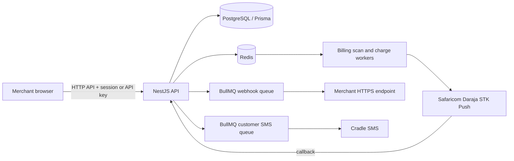

# NiaFlow M-Pesa Billing Engine

NiaFlow helps merchants manage recurring plans and collect them through Safaricom Daraja STK Push. The merchant dashboard is in `web/`; the NestJS API and background workers are in `src/`.

- Production API: <https://mpesa-billing-engine-v1.onrender.com/api>
- API reference (non-production only): `/api/docs`
- Browser app: deployed separately from the API

## Product and payment model

- A merchant creates whole-KES weekly or monthly plans and subscribes members to them.
- Members pay only the plan price. The chosen product direction is a separate predictable monthly merchant fee with a clear SMS allowance; fee collection and final fee amounts are not implemented yet. Do not add the platform fee to a member's plan price.
- Daraja credentials are required per merchant in production and encrypted at rest. Shared environment credentials are for local development and tests only.
- Collection is initiated by an STK Push. A confirmed callback updates the recorded payment attempt and subscription.
- A payment attempt has a unique billing-cycle idempotency key. Duplicate callbacks do not apply a second state transition. Cancellation blocks later charge attempts and a late successful callback cannot reactivate a cancelled subscription.
- Successful callbacks are checked against the attempted amount and member phone whenever Daraja supplies those fields. A mismatch stays pending confirmation rather than being counted as collected. Safaricom receipt numbers and transaction dates are retained in receipt history when provided.
- Merchants can text members a private portal link. Only its SHA-256 token hash is stored, and the link expires after 24 hours. Members can see their plan, next scheduled charge, and latest 20 attempts, or request an eligible payment themselves.
- Clear Daraja rejections enter the 1, 3, and 7 day retry schedule. If the STK request may have reached Daraja but its response is unknown, the attempt stays `PENDING_CONFIRMATION` and automatic charging waits for reconciliation; this avoids prompting a member twice.

## Architecture and request flow



1. A merchant registers with a phone number and password; email is optional and currently used only as contact information. Merchant login is independent of the SMS provider. Passwords are stored as Argon2id hashes, sign-in creates an HttpOnly session cookie, and repeated failures are throttled in Redis. Forgotten passwords use support-assisted recovery; email self-service reset is not enabled. Existing merchants can set an initial password from Settings while authenticated. Merchants who have lost all active sessions and API keys must contact support to regain access. New API keys include an indexed public ID, so each request looks up and verifies one key hash. Older keys remain supported temporarily; rotate them from Settings to move to indexed authentication.
2. The merchant completes PayBill setup with their own Daraja consumer key, consumer secret, shortcode, and passkey. The API encrypts credentials before storage.
3. The merchant creates a weekly or monthly plan and a subscription. The subscription is associated with that merchant and plan.
4. A BullMQ scheduler scans for subscriptions due to be charged every five minutes. Charge workers write the attempt before sending an STK request.
5. Daraja calls the public callback route. The callback token is checked; callbacks that arrive before checkout ID persistence are buffered in `DarajaCallback` and replayed.
6. A merchant can text a member a private link to their subscription and payment activity. Member payment requests use the same payment-attempt and duplicate-charge protections as merchant requests.
7. Merchant event deliveries and customer SMS are queued separately from billing. Webhook delivery signs the JSON body with HMAC-SHA256, retries failures, requires HTTPS, resolves and checks the destination for every attempt, pins the connection to the checked IP, and does not follow redirects. SMS delivery retries transient provider failures.

PostgreSQL is the system of record. Redis supports BullMQ and Daraja access-token caching. Token cache keys are isolated by the merchant credential fingerprint. The dashboard's active-member metric counts active subscriptions among the 10 most recently created; subscription browsing is paginated at 20 rows. “Collected this period” means successful payment attempts in the current Nairobi calendar month. Receipt history includes every attempt.

Merchant session endpoints are `POST /api/auth/signin`, `PUT /api/auth/password` (authenticated; requires current password when one already exists), and `POST /api/auth/logout`. Customer SMS notifications remain a separate service and are not part of merchant authentication. Optional email is not verified and must not be treated as a password recovery factor.

### Private merchant webhook endpoints

Private webhook destinations are supported only when the API host has a real network route to the merchant network. Configure `WEBHOOK_ALLOWED_PRIVATE_CIDRS` with the exact approved destination CIDRs and `WEBHOOK_ALLOWED_PORTS` with required ports. The default port is 443; private address delivery is denied unless its CIDR is allowlisted. These settings enforce destination policy but do not establish VPN, peering, or private links. Loopback, link-local, metadata, multicast, and unspecified destinations remain blocked.

## Repository layout

```text
src/
  auth/          Password login and server-side session management
  billing/       recurring billing scheduler and BullMQ workers
  common/        guards, decorators, DTO utilities, and phone normalization
  merchants/     registration, onboarding, analytics, and Daraja credentials
  notifications/ Cradle SMS and signed merchant webhook delivery
  payments/      Daraja integration, payment attempts, and callbacks
  plans/         merchant-owned billing plans
  subscriptions/ subscription management and receipt history
                 expiring member portal links
  prisma/        Prisma client and database service
web/src/
  pages/         public pages and merchant dashboard routes
  components/    shared UI components and page states
  layouts/       public and authenticated application shells
  api.ts         browser API client and response types
prisma/
  schema.prisma  data model
  migrations/    committed database migrations
```

## Run locally

Requirements: Node.js 22 or later, npm, Docker, and a Daraja sandbox account if you want to exercise STK Push.

```bash
git clone <your-repo-url>
cd billing-engine
npm install
cp .env.example .env
docker compose up -d postgres redis
npx prisma generate
npx prisma migrate dev
npm run start:dev
```

In another terminal, run the browser app:

```bash
cd web
npm install
npm run dev
```

The browser defaults to `http://localhost:3000/api`. Set `VITE_API_URL` in the web build environment when the API uses a different base URL. Set `MPESA_CALLBACK_URL` to a public HTTPS callback URL (for local development, use a tunnel) in the form `/api/webhooks/daraja/callback/<DARAJA_CALLBACK_TOKEN>`; configure the same callback token in the API environment. For a local payment test, this URL must tunnel to the local API. A Render callback URL sends the result to the Render database and cannot update a payment attempt stored in the local database. Keep local and deployed callback tokens separate, and rotate any token that has been exposed.

Generate a local 32-byte credential encryption key with:

```bash
openssl rand -base64 32
```

Apply committed migrations in deployment environments with `npx prisma migrate deploy`. Database migration and API deployment are separate operational steps; merging code does not deploy the API or migrate its database.

## Environment variables

`.env.example` lists runtime variables and safe local defaults. The important production requirements are:

| Variable | Purpose |
| --- | --- |
| `DATABASE_URL` | PostgreSQL connection string |
| `REDIS_URL` | Redis connection used by BullMQ and token caching |
| `FRONTEND_URL` | Exact browser origin allowed to use credentialed session cookies |
| `DARAJA_CALLBACK_TOKEN` | Secret path token for the Daraja callback endpoint |
| `MPESA_CALLBACK_URL` | Public callback base URL configured for STK requests |
| `MPESA_TOKEN_URL`, `STK_PUSH_URL` | Daraja OAuth and STK endpoints |
| `MPESA_CREDENTIAL_ENCRYPTION_KEY` | Base64-encoded 32-byte key for merchant credentials |
| `CONSUMER_KEY`, `CONSUMER_SECRET`, `SHORT_CODE`, `PASSKEY` | Local/test fallback credentials only; production charges require merchant-provided credentials |
| `CRADLE_URL`, `CRADLE_TOKEN` | Cradle SMS provider configuration |
| `WEBHOOK_ALLOWED_PRIVATE_CIDRS`, `WEBHOOK_ALLOWED_PORTS` | Explicit private webhook destination policy |
| `VITE_API_URL` | Browser build-time API base URL, configured in `web/` |

Use a secret manager for production secrets. Do not commit `.env` or live credentials.

## API overview

All API routes are prefixed with `/api`. Protected routes accept either an `x-api-key` header or a valid dashboard session cookie. Merchant-owned lookups are scoped to the authenticated merchant.

| Route | Purpose |
| --- | --- |
| `POST /merchants` or `POST /merchants/onboarding/start` | Register a merchant; save the returned API key |
| `POST /auth/signin`, `PUT /auth/password`, `POST /auth/logout` | Dashboard password sessions and authenticated password setup/change |
| `POST /merchants/me/rotate-api-key` | Immediately invalidate the current key and return one replacement |
| `GET /merchants/dashboard`, `GET /merchants/analytics` | Dashboard counts and analytics |
| `/merchants/me/onboarding`, `/merchants/me/mpesa-setup` | Resume onboarding and set up Daraja credentials |
| `/plans` | Create, list, update, and delete merchant plans |
| `POST /subscriptions` | Create a subscription |
| `GET /subscriptions?page=1` | Fetch subscriptions in 20-row pages; response includes totals and page metadata |
| `GET /subscriptions/:id/receipts` | Get all payment attempts for a subscription |
| `POST /subscriptions/:id/member-link` | Queue an SMS with a private 24-hour member portal link |
| `GET /customer/portal/:token` | View subscription details and the latest 20 payment attempts |
| `POST /customer/portal/:token/pay-now` | Request an eligible payment through the normal payment lifecycle |
| `GET /subscriptions/retry-queue` | View subscriptions awaiting collection recovery |
| `POST /subscriptions/:id/pay-now`, `POST /subscriptions/:id/retry`, `PATCH /subscriptions/:id/cancel` | Request payment, retry, or cancel |
| `POST /webhooks/daraja/callback/:token` | Receive Daraja STK callbacks |

The exact DTOs and response schemas are visible in Swagger outside production at `/api/docs`.

## Webhook consumer notes

Webhook payloads are JSON and include an `X-Webhook-Signature` header containing the lowercase hex HMAC-SHA256 of the exact serialized body. Verify with the merchant webhook secret using a constant-time comparison. Respond with a 2xx status promptly; failed or non-2xx deliveries are retried by BullMQ. Webhook endpoint URLs must use HTTPS. Destinations on private networks require the operator to configure the approved CIDR and port and provide network routing.

## Development checks

```bash
npm test -- --runInBand
npm run build
npm run lint
npm run build --prefix web
npm test --prefix web
```

Lint currently reports three pre-existing unused imports in `src/auth/auth.service.spec.ts`.

## Operational cautions

- Do not automatically resend a `PENDING_CONFIRMATION` STK request. Reconcile with Daraja before deciding whether another charge is safe.
- A pending attempt may mean Daraja did not call the configured callback or that the callback reached a different environment. Check the merchant's M-Pesa transaction record before retrying; this application does not yet automatically query Daraja for a missing callback.
- Keep PostgreSQL backups and Redis availability monitored. Redis outages affect scheduled and queued work.
- The callback token is a shared platform callback secret, while Daraja payment credentials are merchant-specific.
- Deploy the API and frontend independently. Apply database migrations deliberately before relying on code that requires them.
- Automated due-date reminders, overdue notices, payment-result SMS, and customer-facing pricing disclosure remain planned product work. Merchants can send the member portal link from the subscription list; SMS delivery uses the configured Cradle provider and Redis-backed queue.

## License

The package is marked `UNLICENSED`. Set a license and add a `LICENSE` file before distributing the project publicly.
